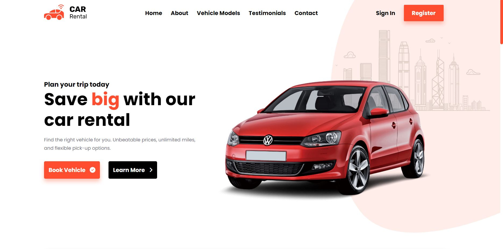

# Description

Front-end showcase of a modern, easy to use car rental service created with vanilla JavaScript, HTML, and CSS.
Although this project would have probably been much easier using a library such as React, I decided not to
because I would like to get more comfortable with the fundamentals of pure html, css and js.

## Demo

https://ccavanaugh18.github.io/car-rental-service/

## Screenshot

  

